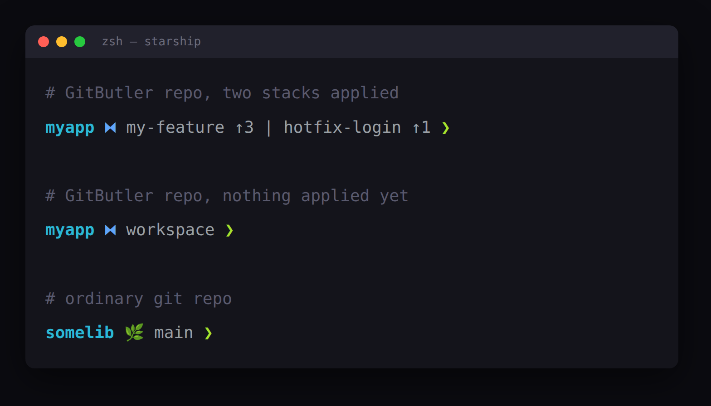

# starship-gitbutler

A [starship](https://starship.rs) prompt segment that knows about [GitButler](https://gitbutler.com). In a butler repo it shows the virtual branches (stacks) you've actually got applied; everywhere else it acts like the normal git branch.

Why: turn a repo into a GitButler project and you get parked on a `gitbutler/workspace` branch, so starship's built-in `git_branch` just prints `gitbutler/workspace`, which is a bit crap. This reads the real picture out of the `but` cli instead.



⧓ is the butler segment, 🌿 is plain git.

The ⧓ is blue: light blue on a dark background, dark blue on a light one. It works that out once per session by asking the terminal for its background colour (OSC 11), then caches it. No answer means it assumes dark; force it with `GITBUTLER_PROMPT_MODE=light` or `dark`. Symbols and colours live at the top of the script.

## How it works

starship is one compiled binary with no plugin system, so this isn't a fork of the git module.. it's a `custom` module running a small bash script (`gitbutler-branch.sh`).

The script decides what to show:

- butler repo (there's a `.git/gitbutler` dir *and* HEAD is on a `gitbutler/*` branch): read the applied stacks from `but status --json`, render `⧓ name ↑N` per branch, joined with ` | `.
- ordinary repo: fall back to `git branch`, e.g. `🌿 main` (short sha when detached).
- not a repo: print nothing, so the segment disappears.

**Note**: both halves of that first test matter. Open a repo in the GitButler app once and it leaves a `.git/gitbutler` dir there for good, so the dir on its own tells you nothing about whether the repo is managed. HEAD parked on `gitbutler/workspace` is what GitButler does when it takes over a checkout, and it's what the `but` cli itself insists on: off that branch `but status` won't answer at all, it just tells you you're "Not currently on a gitbutler/* branch". Unapplying every branch leaves you on the workspace branch, so you keep the ⧓ and it reads `⧓ workspace`.

It always exits 0 and never prints a half-formed segment, so a broken `but`, dodgy json or a missing cache file can't take the prompt down with it.

## Caching

`but status` is about 200ms, too slow to run on every redraw. So the script caches, keyed on the mtime of `.git/gitbutler/REFRESH` (the file gitbutler bumps whenever the workspace changes).

While REFRESH is unchanged you get the cached string back for nothing; when it moves, the script recomputes. Cache lives under `${XDG_CACHE_HOME:-~/.cache}/starship-gitbutler`, keyed on the absolute path to the gitbutler dir, so moving between subdirectories of a repo still hits the same entry.

Some butler repos have no REFRESH file yet, so there's nothing to key on. Those get a write time stamped on the entry instead, expiring after 5 seconds (`BUT_CACHE_TTL` overrides it), which holds `but` down to one call per window rather than one per redraw.

There's a 2s timeout around `but` too (override with `BUT_TIMEOUT`). If `but` ever hangs you get a quick `⧓ workspace` rather than a stalled prompt.

## Requirements

- starship
- the GitButler cli (`but`), 0.22.0 or newer
- jq
- git, bash

`but` 0.22.0 renamed the flag this reads the workspace through, `--format json` became `--json`, and there's no version that takes both. On anything older the read fails.

It uses GNU `stat` for the cache mtime and falls back to BSD `stat -f %m`, so linux and macos both work.

## Install

```bash
git clone https://github.com/1stvamp/starship-gitbutler.git
cd starship-gitbutler
./install.sh
```

`install.sh` symlinks the script into `~/.config/starship/` and prints the config snippet.

Then in `~/.config/starship.toml`: replace `$git_branch` in your `format` with `${custom.gitbutler}`, and add the table:

```toml
[custom.gitbutler]
command = "~/.config/starship/gitbutler-branch.sh"
when = true
shell = ["bash", "--noprofile", "--norc"]
format = "$output "
disabled = false
```

**Note**: leave `$git_commit`, `$git_state` and `$git_status` where they are, they still make sense on the workspace. Got a separate profile (e.g. the Claude Code statusline)? Swap `$git_branch` there too.

## Tests

Plain bash, no framework, just jq:

```bash
bash tests/run.sh
```

Covers: stack rendering against captured `but` json (none, one, several, malformed, partial), the git fallback and detached HEAD, which renderer gets picked (managed workspace, leftover dir on a normal branch, workspace branch with no dir), and the cache (hit, miss, recompute on REFRESH, the TTL fallback with no REFRESH, and degrading to a direct call when the cache dir is unwritable).

## License

Apache 2.0, see [LICENSE](LICENSE).
